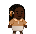

Project for a catcher-style game. Have a working game, but want to organize the project structure. Currently using the Pitchfork Layout (PFL) from https://api.csswg.org/bikeshed/?force=1&url=https://raw.githubusercontent.com/vector-of-bool/pitchfork/develop/data/spec.bs. 

I was able to compile and run the game using the clang compiler for MacOS and cmake, but because I changed the project structure, I have to work on getting these compilers to work again. 

After this is done, I want to continue adding game features. The goals I currently have are:

1. Revamping game textures. This may not be the biggest priority, but I do want to eventually edit things such as Winnie's walk cycle as I feel her leg movementcould be better distinguished.

2. Mochi meter. A speed boost can come after eating a specific number of mochis rather than having to eat just one mochi. 

3. Level design. The levels are currently super short and easy, so I want the game to be more engaging. I can give falling objects alternative paths and speeds.

4. More interactive how-to-play box on the start screen. I want to add tabs to this box for overview/game-controls/about/etc...

5. I don't think THIS game project needs it, but I'd love to implement dialogue boxes at some point. 

Current project structure below. Not all folders/files are listed, but at the top levels this is it.

```
CatchTheMatcha/  
---------------  
├── CMakeLists.txt  
|── src/  
|   |── main.cpp  
|   |── model/  
|   |── view/  
|   |── controller/  
|   └── utils/  
|── data/  
|   |── textures/  
|   |── json/  
|   └── fonts/  
|── tests/  
|── docs/  
|── external/  
|   |── sdl3/  
|   |── json/  
|   └── catch2/  
|── build/  
|   |── clang/  
|   └── cmake/   

src/      : the main classes needed for the game  
data/     : textures, json files, etc.  
tests/    : tests of the main classes using Catch2 library  
docs/     : info on how to compile game  
external/ : third-party libraries (not written by me, everything else, YES)  
build/    : for my personal use in compiling/running executables of the game using different compilers  
```
 
